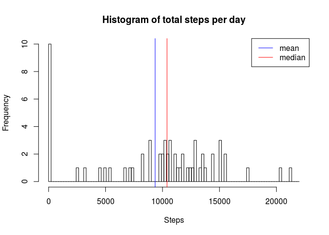
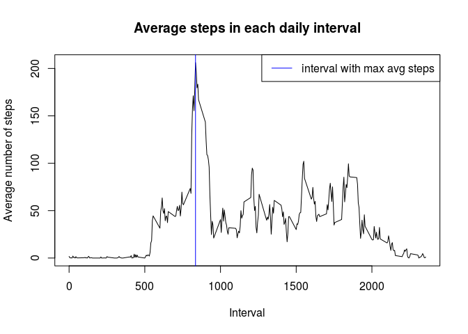
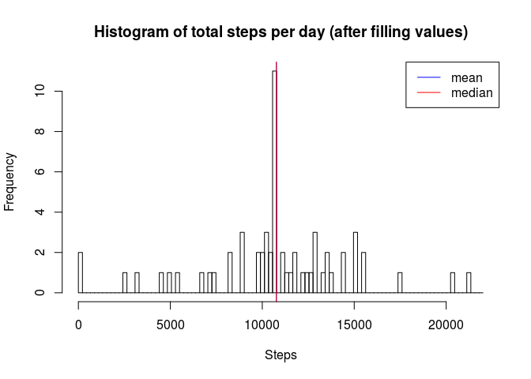
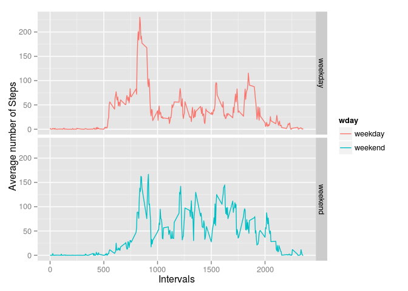

# Reproducible Research: Peer Assessment 1


## Loading and preprocessing the data  
Please ensure that you set the working directory to the directory of the zip data file. The archive will be unzipped and read.

```r
filename <- "activity.zip"
if (!file.exists(filename)) {
    print("Working directory is not set correctly")
}

#unzip the file
filename <- unzip("activity.zip")
data <- read.csv(filename, header=TRUE, sep=",")
```


## What is mean total number of steps taken per day?

Calculate the sum of number of steps for each day. Then compute the mean and median of these values. Notice that we ignore missing values.


```r
library(dplyr)
```

```
## 
## Attaching package: 'dplyr'
## 
## The following object is masked from 'package:stats':
## 
##     filter
## 
## The following objects are masked from 'package:base':
## 
##     intersect, setdiff, setequal, union
```

```r
daystat <- data %>% group_by(date) %>% 
                summarize(sum = sum(steps, na.rm=TRUE))

br <- seq(0,22000, length.out=101)
hist(daystat$sum, breaks=br, 
     main="Histogram of total steps per day", 
     xlab="Steps", ylab="Frequency")
abline(v=mean(daystat$sum, na.rm=TRUE), col="blue", lty=1, lwd=1)
abline(v=median(daystat$sum, na.rm=TRUE), col="red", lty=1, lwd=1)
legend("topright", legend=c("mean", "median"),
       col=c("blue", "red"),lty=c(1,1), lwd=c(1,1))
```

 

```r
paste("Mean of sum of steps per day = ",round(mean(daystat$sum, na.rm=TRUE)))
```

```
## [1] "Mean of sum of steps per day =  9354"
```

```r
paste("Median of sum of steps per day = ",median(daystat$sum, na.rm=TRUE))
```

```
## [1] "Median of sum of steps per day =  10395"
```


## What is the average daily activity pattern?
Compute average number of steps taken for each interval across all days. Later print the interval that has the highest average

```r
intvstat <- data %>% group_by(interval) %>% 
    summarize(avg=mean(steps,na.rm=TRUE))

plot(intvstat$interval, 
     intvstat$avg, 
     type="l",
     main="Average steps in each daily interval",
     xlab="Interval",
     ylab="Average number of steps")
abline(v=intvstat[which.max(intvstat$avg),]$interval, col="blue")
legend("topright", legend="interval with max avg steps",
       col="blue",lty=1, lwd=1)
```

 

```r
print(paste("Interval with maximum number of average steps =", 
      intvstat[which.max(intvstat$avg),]$interval))
```

```
## [1] "Interval with maximum number of average steps = 835"
```


## Imputing missing values

Make a copy of the original data. For each row with missing values, replace the step value with the mean value for the steps in the corresponding interval (the mean for that 5-minute interval across days.)


```r
print(paste("Number of rows with missing values=", sum(!complete.cases(data))))
```

```
## [1] "Number of rows with missing values= 2304"
```

```r
data2 <- data

missing <- which(is.na(data2$steps))

data2$steps[missing] <- sapply(missing, function(ii) {
            intvstat$avg[intvstat$interval == data2$interval[ii]]
            })

print(paste("Number of rows with missing values after filling NAs=", 
            sum(!complete.cases(data2)) ))
```

```
## [1] "Number of rows with missing values after filling NAs= 0"
```
At this point we have a dataset(data2) which has no missing values


```r
daystat <- data2 %>% group_by(date) %>% 
    summarize(sum = sum(steps, na.rm=TRUE))

br <- seq(0,22000, length.out=101)
hist(daystat$sum, breaks=br,
     main="Histogram of total steps per day (after filling values)", 
     xlab="Steps", ylab="Frequency")
abline(v=mean(daystat$sum, na.rm=TRUE), col="blue", lty=1, lwd=1)
abline(v=median(daystat$sum, na.rm=TRUE), col="red", lty=1, lwd=1)
legend("topright", legend=c("mean", "median"),
       col=c("blue", "red"),lty=c(1,1), lwd=c(1,1))
```

 

```r
paste("Mean of sum of steps per day = ",
      round(mean(daystat$sum, na.rm=TRUE)))
```

```
## [1] "Mean of sum of steps per day =  10766"
```

```r
paste("Median of sum of steps per day = ",
      round(median(daystat$sum, na.rm=TRUE)))
```

```
## [1] "Median of sum of steps per day =  10766"
```

Clearly there is a difference between the previously computed values and the ones after filling the missing values.

## Are there differences in activity patterns between weekdays and weekends?

Create a new column to hold the weekday. And then summarize the steps by interval and weekday


```r
wdays <- c("Monday", "Tuesday", "Wednesday", "Thursday", "Friday")

data2 <- mutate(data2, wday = factor(weekdays(as.Date(date)) %in% wdays, 
                                     levels=c(TRUE,FALSE),
                                     labels=c("weekday", "weekend")))

intvstat <- data2 %>% group_by(interval, wday) %>% 
        summarize(avg=mean(steps,na.rm=TRUE))
library(ggplot2)
qplot(interval, 
      avg, 
      data = intvstat, 
      facets=wday~.,
      binwidth=2,
      color=wday,
      geom="line") +
    labs(x = "Intervals") +
    labs(y = "Average number of Steps") 
```

 
